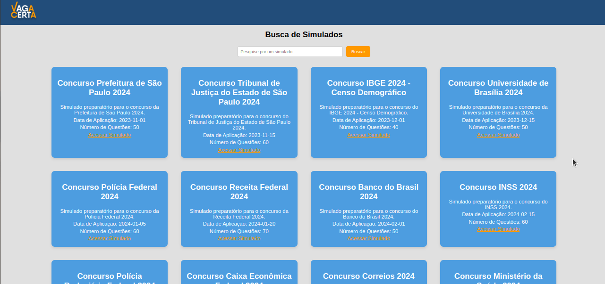
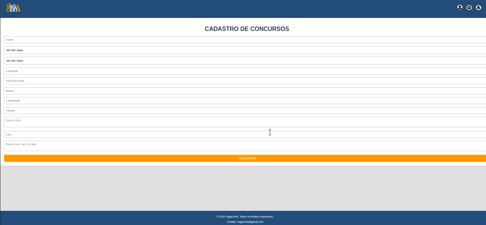

# Introdução

* **Projeto:** Dificuldades em prestar concursos públicos
* **Repositório GitHub:** [LINK PARA O REPOSITÓRIO NO GITHUB](https://github.com/ICEI-PUC-Minas-PMGCC-TI/ti-1-ppl-cc-m-20242-g7-concursos/tree/master)
* **Membros da equipe:**

  * [Gabriel Matos Nogueira](https://github.com/GabrielMatosNogueira)
  * [Gustavo Lopes Oliveira](https://github.com/GustavoLopesOliveira)
  * [Isabel Cristina Borges](https://github.com/isabelcbrg)
  * [João Paulo de Deus Natividade Oliveira Saraiva](https://github.com/Jpdnos)
  * [Nayron Campos Soares](https://github.com/1567164)
  * [Lawer Böuch Soncin Rocha](https://github.com/la-wer)

A documentação do projeto é estruturada da seguinte forma:

1. Introdução
2. Contexto
3. Product Discovery
4. Product Design
5. Metodologia
6. Solução
7. Referências Bibliográficas

✅ [Documentação de Design Thinking (MIRO)](files/pdfmiro)

# Contexto

A dificuldade em encontrar concursos públicos e federais torna-se marcante no contexto brasileiro, uma vez que os candidatos interessados possuem dificuldade em encontrar, de maneira simples, concursos disponíveis, editais, materiais de estudo, datas e futuros concursos abertos (preestabelecidos por entidades públicas). Embora a Internet tenha facilitado a maneira como os candidatos possuem acesso aos concursos e editais, as informações geralmente se encontram fragmentadas e incompletas, com pouca variedade de opções e de difícil coesão temporal, uma vez que os prazos são curtos e a informação sobre as possibilidades são geralmente encaminhas aos usuários próximo a data das provas de seleção, o que diminui a possibilidade de aprovação.

## Problema

A aplicação busca resolver a dificuldade de achar concursos públicos. Muitas pessoas querem fazer concurso mas acabam não sabendo da existência de editais em aberto e ao procurar os sites que possuem um diretório de concursos tem uma navegação ruim, gerando a dificuldade de filtrar por objetivos mais específicos para encontrar um concurso. Além disso também existe a dificuldade em encontrar material de estudo adequado.

## Objetivos

O objetivo é desenvolver um software com uma interface mais intuitiva e mais limpa para que não haja dúvidas e dificuldades durante a navegação do usuário. Criaremos também filtros de pesquisa que são mais específicos para que cada pessoa consiga achar os concursos da área desejada. Para resolver a falta de divulgação dos concursos, criaremos notificações que vão ser enviadas para o celular. O usuário poderá escolher o que vai ser notificado. Também serão fornecidos editais e uma biblioteca de livros para estudo.

## Justificativa

O salário médio no Brasil em 2023, mensalmente, é de aproximadamente R2 979,00 de acordo com o IBGE. Enquanto o menor salário do Concurso Público Nacional Unificado, de acordo com o site "blog.grancursosonline.com.br" é R$5.212,29 podendo chegar a R$20.924,80. Cerca de 1% da população se inscreveu para o Concurso Público Nacional Unificado, de acordo com o site "www.acheconcursos.com.br". Com o acesso à informação e divulgação de forma mais simples esse número vai ser maior.

## Público-Alvo

A aplicação tem como base de público-alvo, alcançar pessoas as quais estão à procura de concursos públicos entre a faixa etária de 23 e 42 anos de idade, contemplando os níveis de escolaridade desde o ensino básico, médio e superior, abrangendo várias áreas profissionais como segmentação de atuação e atentendo a demanada de várias regiões do país.

# Product Discovery

## Etapa de Entendimento

#### **Matriz CSD**


#### **Mapa de stakeholders**


#### **Entrevistas qualitativas**


#### **Highlights de pesquisa**


## Etapa de Definição

### Personas


# Product Design

Nesse momento, vamos transformar os insights e validações obtidos em soluções tangíveis e utilizáveis. Essa fase envolve a definição de uma proposta de valor, detalhando a prioridade de cada ideia e a consequente criação de wireframes, mockups e protótipos de alta fidelidade, que detalham a interface e a experiência do usuário.

## Histórias de Usuários

Com base na análise das personas foram identificadas as seguintes histórias de usuários:

| EU COMO...`PERSONA` | QUERO/PRECISO ...`FUNCIONALIDADE`        | PARA ...`MOTIVO/VALOR`               |
| --------------------- | ------------------------------------------ | -------------------------------------- |
| Graduando de Direito/Adm | Saber quais os concursos disponíveis na minha área de interesse | Me preparar de maneira efetiva |
| Estudante de Concurso | Saber como e quando me preparar | Ter maiores chances de passar |
| "Concurseiro" (Mais de uma opção de curso) | De indicações de material de estudo de fácil acesso | Dedicar mais tempo estudando do que procurando livros |
| Desempregado | Uma funcionalidade que mostre todos os concursos em um determinado raio de distância | Saber as oportunidades regionais de emprego |
| Funcionário Público | Notícias sobre os concursos abertos | Informar meus amigos e familiares |
| Um jovem com dificuldade com horários | Um ciclo de estudos personalizado | Melhorar a minha agenda |
| Chefe de Empresa | Um local para disponibilizar concursos | Contratar funcionários |
| Aposentado | Concursos que atendam minha faixa etária | Voltar ao mercado de trabalho |
| Militar | Concursos da área militar | Me informar sobre testes físicos e disciplinares |

## Proposta de Valor

##### Proposta para Joaquim


##### Proposta para Guilherme


##### Proposta para Roberta


## Requisitos

As tabelas que se seguem apresentam os requisitos funcionais e não funcionais que detalham o escopo do projeto.

### Requisitos Funcionais

| ID  | Descrição do requisito                                                                                                                                 | Prioridade |
|-----|--------------------------------------------------------------------------------------------------------------------------------------------------------|------------|
| 1   | O site deve permitir o cadastro de usuários (com dados como nome, e-mail e senha).                                                                      | Alta       |
| 2   | Botão de login.                                                                                                                                        | Alta       |
| 3   | Deve haver autenticação de usuários por meio de login e senha.                                                                                          | Alta       |
| 4   | O site deve oferecer uma opção de recuperação de senha por e-mail e telefone.                                                                           | Média      |
| 5   | Os usuários devem poder pesquisar concursos públicos por palavras-chave, área de atuação, estado/região e cargo.                                        | Alta       |
| 6   | A busca deve ser capaz de filtrar resultados por data de inscrição, nível de escolaridade, faixa etária e faixa salarial.                               | Alta       |
| 7   | O site deve exibir uma lista de concursos ativos, com informações principais como: nome do concurso, órgão/empresa organizadora, datas e vagas.         | Alta       |
| 8   | O site deve exibir salário e link para o edital nos concursos ativos.                                                                                   | Alta       |
| 9   | Os usuários devem poder se inscrever para receber notificações sobre novos concursos com base em suas preferências.                                      | Alta       |
| 10  | O sistema deve enviar alertas por e-mail, SMS e caixa de entrada quando novos concursos forem lançados.                                                 | Alta       |
| 11  | Ao clicar em um concurso, o usuário deve ver uma página de detalhes com informações completas, link para edital, inscrição e calendário do concurso.     | Alta       |
| 12  | O site deve oferecer simulados e provas anteriores de concursos.                                                                                        | Média      |
| 13  | Deve haver uma seção com materiais de estudo (livros, apostilas, vídeo aulas, dicas) para diversos cargos e áreas.                                       | Média      |
| 14  | Os usuários devem poder salvar concursos de interesse em uma lista de favoritos para acesso rápido.                                                     | Média      |
| 15  | O site deve conter uma seção de notícias sobre concursos públicos, com atualizações sobre editais, resultados e dicas de preparação.                    | Média      |
| 16  | Cada usuário deve ter acesso a um painel pessoal onde pode ver concursos favoritos, acompanhar notificações e acessar o histórico de concursos.          | Alta       |
| 17  | O site deverá ter um FAQ para ajudar os usuários.                                                                                                       | Média      |
| 18  | O site deve oferecer suporte técnico ao usuário, com canais de atendimento via chat, e-mail ou telefone.                                                | Alta       |


### Requisitos não Funcionais

| ID  | Descrição do requisito                                                                                                                                   | Prioridade |
|-----|----------------------------------------------------------------------------------------------------------------------------------------------------------|------------|
| 19  | O site deverá ser publicado de forma pública na internet.                                                                                                 | Alta       |
| 20  | Deve utilizar HTML e CSS.                                                                                                                                 | Alta       |
| 21  | O sistema deve ser capaz de suportar pelo menos 10.000 usuários ativos simultaneamente sem perda de desempenho.                                           | Alta       |
| 22  | O site deve ser escalável, ou seja, deve poder aumentar a capacidade de atendimento com o crescimento do número de usuários.                              | Alta       |
| 23  | Todas as comunicações entre o usuário e o site devem ser feitas através de HTTPS (protocolo seguro).                                                      | Alta       |
| 24  | As senhas dos usuários devem ser armazenadas de forma criptografada.                                                                                      | Alta       |
| 25  | Backup diário das informações para evitar perda de dados em caso de falhas.                                                                               | Alta       |
| 26  | O site deve estar disponível 99,9% do tempo.                                                                                                              | Alta       |
| 27  | Deve ser fácil de navegar, com poucos cliques para acessar os principais conteúdos.                                                                       | Média      |
| 28  | O site deve ser compatível com os navegadores mais usados, como Google Chrome, Mozilla Firefox, Safari e Microsoft Edge.                                  | Alta       |
| 29  | O site deve funcionar corretamente em diferentes dispositivos, como desktops, tablets e smartphones.                                                      | Alta       |
| 30  | O código do site deve ser modular e seguir boas práticas de programação, facilitando a manutenção e adição de novas funcionalidades.                      | Média      |
| 31  | O sistema deve ser facilmente atualizável, permitindo a implementação de novas funcionalidades sem interrupções significativas.                           | Média      |
| 32  | O sistema deve ser projetado de forma a permitir a migração para outras plataformas de hospedagem sem grande esforço.                                      | Média      |
| 33  | O site deve ser compatível com diferentes sistemas operacionais e servidores (Windows, Linux, etc.).                                                      | Média      |
| 34  | Toda a documentação técnica do sistema deve ser mantida e acessível para a equipe de desenvolvimento e manutenção.                                         | Média      |
| 35  | O sistema deve permitir a adaptação para múltiplos idiomas e formatos regionais.                                                                          | Média      |

## Projeto de Interface

Artefatos relacionados com a interface e a interacão do usuário na proposta de solução.

### Wireframes

Estes são os protótipos de telas do sistema.


##### TELA DE CADASTRO

Onde o usuário poderá fazer o primeiro cadastro.


#### TELA DE LOGIN

Onde o usuário poderá fazer o login após se cadastrar ou retornar ao app.


#### TELA DE RECUPERAÇÃO DE SENHA

Onde o usuário poderá recuperar sua senha.


#### TELA DE HOME

Tela inicial onde o usuário poderá acessar as funcionalidades do app.


#### TELA DE PROVAS E SIMULADOS

Onde o usuário poderá consultar provas e simulados disponíveis.


#### TELA DE MATERIAIS DE ESTUDO

Onde o usuário poderá consultar materiais de estudo disponíveis.


#### TELA DE CONCURSOS

Onde o usuário poderá consultar os concursos disponíveis.


#### TELA DE EDITAIS

Onde o usuário poderá conferir os editais dos cursos disponíveis.


#### TELA DE CALENDÁRIO

Onde o usuário poderá consultar os concursos futuros cadastrados.


#### TELA DE CONFIGURAÇÕES

Onde o usuário poderá configurar e acessar informações sobre o app.


#### TELA DE APARÊNCIA

Onde o usuário poderá modificar aspectos de aparência do aplicativo.


#### TELA DE PRIVACIDADE E SEGURANÇA

Onde o usuário poderá conferir as diretrizes do app.


#### TELA DE NOTIFICAÇÕES

Onde o usuário poderá conferir novidades e notificações do app.


#### TELA DE FAQ

Tela onde o usuário poderá tirar dúvidas frequentes sobre o app.


#### TELA DE SOBRE

Onde o usuário poderá conhecer um pouco mais sobre a história do aplicativo.


### User Flow


### Protótipo Interativo

✅ [Protótipo Interativo (Figma)](https://www.figma.com/proto/ENQz2rYdKyTwRPfqBOEvGZ/Prototipo-TI?node-id=5-2&node-type=canvas&t=AgwKRiTkJKDNl0ZZ-0&scaling=scale-down&content-scaling=fixed&page-id=0%3A1&starting-point-node-id=5%3A2)

# Metodologia

## Ferramentas

Relação de ferramentas empregadas pelo grupo durante o projeto.

| Ambiente                    | Plataforma | Link de acesso                                     |
| --------------------------- | ---------- | -------------------------------------------------- |
| Processo de Design Thinking | Miro       | https://miro.com/app/board/uXjVKoWG8Ew=/       |
| Repositório de código     | GitHub     | https://github.com/ICEI-PUC-Minas-PMGCC-TI/ti-1-ppl-cc-m-20242-g7-concursos/tree/master/codigo      |
| Hospedagem do site          | Render     | https://site.render.com/XXXXXXX |
| Protótipo Interativo       | Figma      | https://www.figma.com/proto/ENQz2rYdKyTwRPfqBOEvGZ/Prototipo-TI?node-id=5-2&node-type=canvas&t=AgwKRiTkJKDNl0ZZ-0&scaling=scale-down&content-scaling=fixed&page-id=0%3A1&starting-point-node-id=5%3A2   |

## Gerenciamento do Projeto

A organização da equipe foi divida em quatro grupos, cada um responsáveis pelas funções requisitadas para a entrega das atividades: Github, Figma, PowerPoint e Miro.
O grupo foi dividido em:

* **Github** - Lawer, Gabriel;
* **Figma** - Lawer, Gabriel, João, Gustavo, Rafael, Nayron;
* **PowerPoint** - Isabel e Nyron;
* **Miro** - João e Nyron.

# Solução Implementada

Esta seção apresenta todos os detalhes da solução criada no projeto.

## Vídeo do Projeto

O vídeo a seguir traz uma apresentação do problema que a equipe está tratando e a proposta de solução. ⚠️ EXEMPLO ⚠️

[](https://www.youtube.com/embed/70gGoFyGeqQ)

> ⚠️ **APAGUE ESSA PARTE ANTES DE ENTREGAR SEU TRABALHO**
>
> O video de apresentação é voltado para que o público externo possa conhecer a solução. O formato é livre, sendo importante que seja apresentado o problema e a solução numa linguagem descomplicada e direta.
>
> Inclua um link para o vídeo do projeto.

## Funcionalidades

Esta seção apresenta as funcionalidades do nosso site.


  #### Funcionalidade 1 - Cadastro de Livros

  Permite a inclusão, leitura, alteração e exclusão dos livros para o sistema

  * **Estrutura de dados:** [Livros](#estrutura-de-dados-livros)
  * **Instruções de acesso:**
    * Abra o site 
    * Acesse o menu principal e escolha a opção Cadastro de Livros
  * **Tela da funcionalidade**:

  

  #### Funcionalidade 2 - Exebição de Livros
  
  Permite a pesquisa dos livros cadastrados.

  * **Estrutura de dados:** [Livros](#estruturas-de-dados-livros)
  * **Instruções de acesso:**
    * Abra o site. 
    * Acesse o menu principal e escolha a opção Biblioteca
  * **Tela da funcionalidade**:

  

  #### Funcionalidade 3 - Simulados

  Mostra todos os simulados para determinados concursos.

  * **Estrutura de dados:** [Simulados](#estrutura-de-dados-simulados)
  * **Instruções de acesso:**
    * Abra o site.
    * Acesse o menu principal e escolha a opção simulados.
  * **Tela da funcionalidade**:

    

  #### Funcionalidade 4 - Cadastro dos Concursos

  Permite o cadastro de novos concursos.

  * **Estrutura de dados:** [Concursos](#estrutura-de-dados-concursos)
  * **Instruções de acesso:**
    * Abra o site.
    * Acesse o menu principal e escolha a opção Cadastro de Concursos.
  * **Tela da funcionalidade**:

  

  #### Funcionalidade 5 - Exebição dos Concursos

  Mostra todos os concursos cadastrados.

  * **Estrutura de dados:** [Concursos](#estrutura-de-dados-concursos)
  * **Instruções de acesso:**
    * Abra o site.
    * Acesse o menu principal e escolha a opção Concursos.
  * **Tela da funcionalidade**:

  

  #### Funcionalidade 6 - Cronograma

  Exibe os cronogramas cadastrados e permite o cadastro também.

  * **Estrutura de dados:** [Carga Hóraria](#estrutura-de-dados-carga-horária)
  * **Instruções de acesso:**
    * Abra o site.
    * Acesse o menu principal e escolha a opção Cronograma.
  * **Tela da funcionalidade**:

  


  ## Estruturas de Dados

  Descrição das estruturas de dados utilizadas na solução com exemplos no formato JSON.Info

  ##### Estrutura de Dados: Livros

  Livros da aba de estudos

  ```json
    
  {
    "id": "1",
    "titulo": "Algebrista Volume 1 Teoria e Exercícios de Fixação",
    "materia": "Matemática",
    "editora": "Ciência Moderna",
    "descricao": "Algebrista é todo aquele que possui grande habilidade em álgebra...",
    "link": "https://www.amazon.com.br/Algebrista-Exerc%C3%ADcios-Fixa%C3%A7%C3%A3o..."
  },
  {
    "id": "2",
    "titulo": "Gramática completa para concursos e vestibulares",
    "materia": "Português",
    "editora": "Saraiva",
    "descricao": "Gramática completa para concursos e vestibulares traz a teoria gramatical completa...",
    "link": "https://www.amazon.com.br/Gram%C3%A1tica-Completa-Para-Concursos-Vestibulares..."
  },
  {
    "id": "3",
    "titulo": "Matemática e lógica para concursos",
    "materia": "Matemática",
    "editora": "Saraiva",
    "descricao": "Esta edição já está de acordo com a nova ortografia...",
    "link": "https://www.amazon.com.br/Matem%C3%A1tica-L%C3%B3gica-Para-Concursos..."
  }

  ```

##### Estrutura de Dados: Usuários

Registro dos usuários do sistema utilizados para login e para o perfil do sistema

```json
  {
      "id": "1",
      "login": "admin",
      "senha": "123",
      "nome": "Administrador do Sistema",
      "email": "admin@abc.com"
    },
    {
      "id": "2",
      "login": "user",
      "senha": "123",
      "nome": "Usuario Comum",
      "email": "user@abc.com"
    },
    {
      "login": "rommel",
      "senha": "123",
      "nome": "Rommel",
      "email": "rommel@gmail.com",
      "id": "3"
    }
```

##### Estrutura de Dados: Concursos

Lista de concursos disponibilizados

```json
  {
      "nome": "Concurso Prefeitura de São Paulo 2024",
      "dataInscricao": "2024-01-15",
      "dataProva": "2024-03-10",
      "categoria": "Administração Pública",
      "nivelEnsino": "Superior",
      "banca": "Fundação Vunesp",
      "localizacao": "São Paulo, SP",
      "horario": "14:00",
      "descricao": "Concurso para diversos cargos administrativos na Prefeitura de São Paulo.",
      "link": "https://www.prefeitura.sp.gov.br/concursos",
      "materiais": "Edital completo, apostilas para administração pública"
    },
    {
      "nome": "Concurso Tribunal de Justiça do Estado de São Paulo 2024",
      "dataInscricao": "2024-02-01",
      "dataProva": "2024-04-05",
      "categoria": "Jurídica",
      "nivelEnsino": "Superior",
      "banca": "Vunesp",
      "localizacao": "São Paulo, SP",
      "horario": "09:00",
      "descricao": "O concurso oferece vagas para diversos cargos no Tribunal de Justiça do Estado de São Paulo.",
      "link": "https://www.tjsp.jus.br/concursos",
      "materiais": "Edital, apostilas para direito, legislação específica"
    },
    {
      "nome": "Concurso IBGE 2024 - Censo Demográfico",
      "dataInscricao": "2024-03-01",
      "dataProva": "2024-06-15",
      "categoria": "Pesquisa e Estatística",
      "nivelEnsino": "Médio",
      "banca": "CESPE",
      "localizacao": "Em todo o Brasil",
      "horario": "A definir",
      "descricao": "Concurso para atuação como recenseador do Censo Demográfico do IBGE 2024.",
      "link": "https://www.ibge.gov.br/concursos",
      "materiais": "Edital, apostilas de matemática básica, geografia"
    },
    {
      "nome": "Concurso Universidade de Brasília 2024",
      "dataInscricao": "2024-04-05",
      "dataProva": "2024-08-20",
      "categoria": "Educação",
      "nivelEnsino": "Superior",
      "banca": "Instituto Acesso",
      "localizacao": "Brasília, DF",
      "horario": "10:00",
      "descricao": "Vagas para professores e técnico-administrativos na Universidade de Brasília.",
      "link": "https://www.unb.br/concursos",
      "materiais": "Edital, apostilas de didática e concurso público"
    }
```

##### Estrutura de Dados: Simulados

Lista de simulados disponíveis na plataforma

```json
  {
      "id": 1,
      "nome": "Simulado ENEM 2024",
      "concurso": "ENEM",
      "data": "2024-11-20"
    },
    {
      "id": 2,
      "nome": "Simulado Concurso INSS",
      "concurso": "INSS",
      "data": "2024-12-01"
    },
    {
      "id": 3,
      "nome": "Simulado Concurso Banco do Brasil",
      "concurso": "Banco do Brasil",
      "data": "2024-12-10"
    },
    {
      "id": 4,
      "nome": "Simulado Concurso Polícia Federal",
      "concurso": "Polícia Federal",
      "data": "2024-11-25"
    },
    {
      "id": 5,
      "nome": "Simulado Concurso Receita Federal",
      "concurso": "Receita Federal",
      "data": "2024-12-15"
    }
```

##### Estrutura de Dados: Carga Horária

Lista de carga horárias disponíveis no sistema

```json
  {
      "nome": "Policia Militar",
      "materias": [
        {
          "nome": "Língua Portuguesa",
          "prioridade": 4,
          "livro": "Gramática Completa para Concursos e Vestibulares"
        },
        {
          "nome": "Raciocínio Lógico",
          "prioridade": 3,
          "livro": "Raciocínio Lógico e Matemática para Concursos"
        },
        {
          "nome": "Informática",
          "prioridade": 5,
          "livro": "Série Provas & Concursos - Informática para Concursos - Teoria e Questões"
        },
        {
          "nome": "Direito Administrativo",
          "prioridade": 1,
          "livro": "Manual de Direito Administrativo"
        },
        {
          "nome": "Direito Constitucional",
          "prioridade": 2,
          "livro": "Direitos Fundamentais e Controle de Constitucionalidade"
        }
      ]
    },
    {
      "nome": "Auditor Fiscal",
      "materias": [
        {
          "nome": "Língua Portuguesa",
          "prioridade": 5,
          "livro": "Gramática Completa para Concursos e Vestibulares"
        },
        {
          "nome": "Direito Tributário",
          "prioridade": 1,
          "livro": "Manual de Direito Tributário"
        },
        {
          "nome": "Raciocínio Lógico",
          "prioridade": 4,
          "livro": "Raciocínio Lógico e Matemática para Concursos"
        },
        {
          "nome": "Direito Administrativo",
          "prioridade": 3,
          "livro": "Manual de Direito Administrativo"
        },
        {
          "nome": "Contabilidade",
          "prioridade": 2,
          "livro": "Contabilidade Geral Para Concurso Público"
        }
      ]
    },
    {
      "nome": "Analista Judiciario",
      "materias": [
        {
          "nome": "Língua Portuguesa",
          "prioridade": 7,
          "livro": "Gramática Completa para Concursos e Vestibulares"
        },
        {
          "nome": "Raciocínio Lógico",
          "prioridade": 6,
          "livro": "RACIOCÍNIO LÓGICO E MATEMÁTICA PARA CONCURSOS"
        },
        {
          "nome": "Informática",
          "prioridade": 5,
          "livro": "Série Provas & Concursos - Informática para Concursos - Teoria e Questões"
        },
        {
          "nome": "Direito Administrativo",
          "prioridade": 3,
          "livro": "Manual de Direito Administrativo"
        },
        {
          "nome": "Direito Constitucional",
          "prioridade": 2,
          "livro": "Direitos fundamentais e controle de constitucionalidade - Estudos de Direito Constitucional"
        },
        {
          "nome": "Direito Penal",
          "prioridade": 1,
          "livro": "Direito Penal - Parte Geral"
        },
        {
          "nome": "Noções de Direito das Pessoas com Deficiência",
          "prioridade": 4,
          "livro": "DIREITOS HUMANOS DAS PESSOAS COM DEFICIÊNCIA"
        }
      ]
    },
    {
      "nome": "Engenharia Civil",
      "materias": [
        {
          "nome": "Estruturas",
          "prioridade": 1,
          "livro": "Cálculo e Detalhamento de Estruturas Usuais de Concreto Armado"
        },
        {
          "nome": "Geotécnica",
          "prioridade": 2,
          "livro": "Fundamentos De Engenharia Geotécnica"
        },
        {
          "nome": "Fiscalização, Contratos e Licitações",
          "prioridade": 3,
          "livro": "Manual de Obras e Serviços de Engenharia: Fundamentos da Licitação e Contratação"
        },
        {
          "nome": "Planejamento e Orçamento",
          "prioridade": 4,
          "livro": "Planejamento e Controle de Obras"
        },
        {
          "nome": "Análise Estrutural",
          "prioridade": 5,
          "livro": "Análise Estrutural Usando Métodos Clássicos e Métodos Matriciais"
        }
      ]
    }
```


## Módulos e APIs

Esta seção apresenta os módulos e APIs utilizados na solução

**Images**:

* Unsplash - [https://unsplash.com/](https://unsplash.com/) ⚠️ EXEMPLO ⚠️

**Fonts:**

* Kanit - [https://fonts.google.com/specimen/Kanit](https://fonts.google.com/specimen/Kanit)

**Scripts:**

* jQuery - [http://www.jquery.com/](http://www.jquery.com/) ⚠️ EXEMPLO ⚠️
* Bootstrap 4 - [http://getbootstrap.com/](http://getbootstrap.com/) ⚠️ EXEMPLO ⚠️

> ⚠️ **APAGUE ESSA PARTE ANTES DE ENTREGAR SEU TRABALHO**
>
> Apresente os módulos e APIs utilizados no desenvolvimento da solução. Inclua itens como: (1) Frameworks, bibliotecas, módulos, etc. utilizados no desenvolvimento da solução; (2) APIs utilizadas para acesso a dados, serviços, etc.

# Referências

As referências utilizadas no trabalho foram:

* Blog AcheConcursos: https://www.acheconcursos.com.br/concurso-nacional-unificado-cnu/concurso-unificado-cnu-inscritos-por-estado-68725#:~:text=O%20Concurso%20Nacional%20Unificado%20(CNU)%20bateu%20a%20marca,CNU%20registrou%20mais%20de%202%2C65%20milhões%20de%20inscritos
* Notícias R7: https://noticias.r7.com/economia/salario-medio-do-trabalhador-cresce-e-atinge-r-2979-ibge-31012024/
* Blog GranCursosOnline: https://blog.grancursosonline.com.br/concurso-nacional-unificado-remuneracao/#:~:text=Menor%20remuneração%3A%20inicial%20de%20R%24%205.212%2C29,Maior%20remuneração%3A%20inicial%20de%20R%24%2020.924%2C80 


